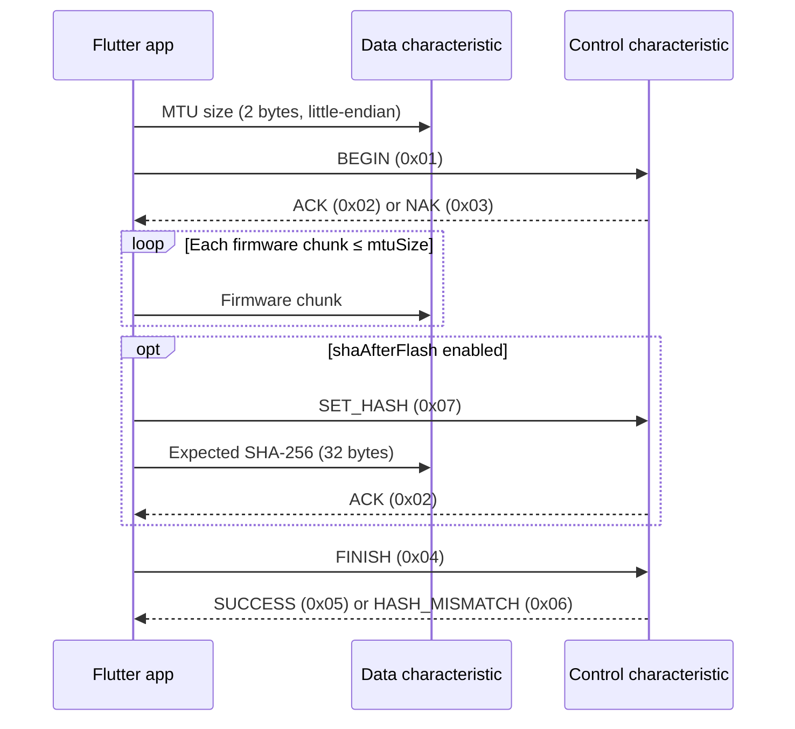
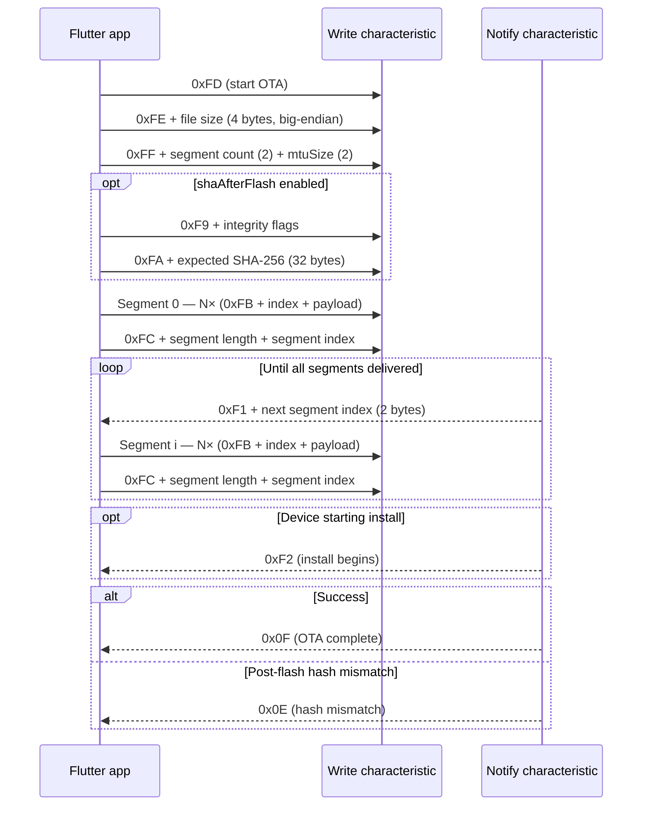

# flutter_ota — Package Documentation

A Flutter package for performing **Over-The-Air (OTA) firmware updates** on
ESP32 devices over **Bluetooth Low Energy (BLE)**.

- **Package name:** `flutter_ota`
- **Current version:** `1.0.0`
- **Repository:** https://github.com/sparkleo-io/flutter_ota
- **Publisher:** sparkleo.io
- **SDK requirements:** Dart `>=3.8.0 <4.0.0`, Flutter `>=3.32.0`
- **Also see:** [MIGRATION.md](MIGRATION.md) (0.x → 1.0.0), [FAQ.md](FAQ.md),
  [CONTRIBUTING.md](CONTRIBUTING.md)

---

## Table of Contents

1. [What is this package & why it exists](#1-what-is-this-package--why-it-exists)
2. [Main features](#2-main-features)
3. [How to use it](#3-how-to-use-it)
4. [Protocol handshake sequences](#4-protocol-handshake-sequences)
5. [Changelog — what's new in 1.0.0](#5-changelog--whats-new-in-100)

---

## 1. What is this package & why it exists

`flutter_ota` is a Flutter package that lets a mobile app **wirelessly flash new
firmware onto an ESP32 microcontroller using Bluetooth Low Energy (BLE)** — no
USB cable, no serial port, no physical access to the device.

### The problem it solves

ESP32 devices are typically flashed over a wired serial connection during
development. Once a device ships inside a product (a wearable, a sensor, a smart
appliance), you can no longer plug in a cable to update its firmware. The only
practical channel left is the radio the device already uses to talk to the phone:
**BLE**.

Implementing OTA-over-BLE by hand is fiddly: you have to negotiate an MTU, split
the firmware binary into correctly-sized packets, drive the device's OTA state
machine with the right control bytes, track acknowledgements, and translate all
of that into UI progress — while gracefully surviving disconnects mid-transfer.

`flutter_ota` packages all of that into a single, high-level call:

```dart
await otaPackage.updateFirmware(
  device,
  UpdateType.espidf,
  FirmwareType.url,
  uri: 'https://example.com/firmware.bin',
);
```

### Why it was created

- To give Flutter apps a **drop-in, reusable OTA layer** for ESP32 instead of
  re-implementing the BLE byte protocol in every project.
- To support **both major ESP32 firmware ecosystems** — the official **ESP-IDF**
  framework and the **Arduino** framework — which use different OTA protocols on
  the wire.
- To make the update process **observable** (a progress stream) and **safe**
  (typed errors, early validation, crash-free handling of BLE failures).

---

## 2. Main features

### Multiple firmware sources

The firmware binary can come from three different places, selected via the
`FirmwareType` enum:

```1:7:lib/src/models/update_type.dart
/// The type of update protocol used to flash the firmware.
///
/// * [UpdateType.espidf]: Firmware update following the ESP-IDF/Espressif
///   framework (formerly represented by the integer `1`).
/// * [UpdateType.arduino]: Firmware update based on the Arduino framework for
///   ESP32 (formerly represented by the integer `2`).
enum UpdateType { espidf, arduino }
```

```1:9:lib/src/models/firmware_type.dart
/// The source from which the firmware binary is loaded.
///
/// * [FirmwareType.assets]: Load the firmware from the app's bundled assets
///   (formerly represented by the integer `1`).
/// * [FirmwareType.filepicker]: Let the user pick the firmware file from the
///   device (formerly represented by the integer `2`).
/// * [FirmwareType.url]: Download the firmware from a URL (formerly represented
///   by the integer `3`).
enum FirmwareType { assets, filepicker, url }
```

- **`FirmwareType.assets`** — a `.bin` bundled in your Flutter app's assets.
- **`FirmwareType.filepicker`** — a file the user picks from device storage.
- **`FirmwareType.url`** — a binary downloaded over HTTP at update time.

### Support for both ESP-IDF and Arduino firmware

The package supports both major ESP32 firmware types — ESP-IDF and Arduino — with an easy-to-use `updateFirmware` method that works for either.

### Optional firmware integrity verification

Pass a `FirmwareIntegrityConfig` to `updateFirmware` to enable any combination
of checks your device (and server) support. Default is none — wire format is
unchanged for existing firmware.

| Feature | Role |
| --- | --- |
| `shaBeforeTransfer` | App SHA-256 vs server digest before BLE |
| `shaAfterFlash` | Device verifies flash SHA-256 before success/reboot |

```dart
await otaPackage.updateFirmware(
  device,
  UpdateType.arduino,
  FirmwareType.url,
  uri: firmwareUrl,
  integrity: FirmwareIntegrityConfig(
    features: {
      IntegrityFeature.shaBeforeTransfer,
      IntegrityFeature.shaAfterFlash,
    },
    expectedSha256Hex: serverSha256Hex,
  ),
);
```

### Real-time progress stream

`percentageStream` emits the update progress (0–100) so the UI can show a
progress bar live:

```42:49:lib/src/models/ota_package.dart
  /// Stream to provide progress percentage.
  ///
  /// When an update is cancelled via [cancelUpdate], a value of [cancelledValue]
  /// (`-1`) is emitted so listeners can react to the cancellation. If the update
  /// fails because of a BLE error (e.g. the device disconnects mid-transfer or a
  /// write fails with a GATT error), [failedValue] (`-2`) is emitted instead of
  /// throwing, so the caller can update the UI without the app crashing.
  Stream<int> get percentageStream;
```

Two sentinel values let listeners distinguish terminal outcomes without
try/catch noise in the UI:

```1:7:lib/src/models/constants.dart
/// Value emitted on [OtaPackage.percentageStream] when an update is cancelled.
const int cancelledValue = -1;

/// Value emitted on [OtaPackage.percentageStream] when an update fails because
/// of a BLE error (e.g. the device disconnects or a write fails with a GATT
/// error). The package emits this instead of throwing so the app does not crash.
const int failedValue = -2;
```

### Configurable, protocol-aware chunk size (`mtuSize`)

You can tune the number of firmware bytes sent per BLE packet. The value is
validated **up front** against each protocol's max write size (BLE single-write
limit of 512 bytes, with Arduino reserving header/CRC overhead) — so a bad
value throws *before* any data is sent instead of failing mid-transfer:

```92:98:lib/src/esp32_ota_package.dart
      final OtaProtocol protocol = _protocolFor(updateType, integrity);
      if (mtuSize < 1 || mtuSize > protocol.maxWriteSize) {
        throw OtaException(
          'mtuSize must be between 1 and ${protocol.maxWriteSize} bytes for '
          '${updateType.name} (got $mtuSize).',
        );
      }
```

### Typed error hierarchy

Setup/loading failures are reported as typed exceptions so callers can branch on
the failure type instead of parsing strings:

```6:41:lib/src/exceptions/ota_exceptions.dart
class OtaException implements Exception {
  OtaException(this.message, [this.cause]);

  /// Human-readable description of what went wrong.
  final String message;

  /// The underlying error that caused this exception, if any.
  final Object? cause;

  @override
  String toString() => cause == null
      ? 'OtaException: $message'
      : 'OtaException: $message ($cause)';
}

/// Thrown when a firmware source yields no data.
///
/// Examples: an empty asset/file, an empty HTTP response body, or no file
/// selected from the picker. Signals the caller to abort before any OTA writes
/// are sent to the device.
class EmptyFirmwareException extends OtaException {
  EmptyFirmwareException([
    super.message =
        'Firmware is empty. Please provide a valid, non-empty firmware binary.',
  ]);
}

/// Thrown when downloading firmware over HTTP fails (non-200 status, timeout,
/// or network error).
class FirmwareDownloadException extends OtaException {
  FirmwareDownloadException(String message, {this.statusCode, Object? cause})
    : super(message, cause);

  /// The HTTP status code, when the failure was an unsuccessful response.
  final int? statusCode;
}
```

### Early validation of empty firmware

Before any BLE handshake or write, the package aborts if the firmware is empty,
so the device is never left mid-update with nothing to flash:

```75:78:lib/src/core/ota_client.dart
      final Uint8List firmware = await _source.load();
      if (firmware.isEmpty) {
        throw EmptyFirmwareException();
      }
```

### Crash-safe handling of BLE failures

If the device disconnects mid-transfer or a write fails with a GATT error, the
package reports it on the stream (`failedValue`) instead of letting the exception
propagate and crash the app:

```153:161:lib/src/core/ota_client.dart
  void _handleUpdateError(Object error) {
    otaLogger.e(
      'OTA update aborted: Device either returned an error or did not acknowledge the operation. '
      'Some devices may not support acknowledgement.'
      'Please ensure the device firmware supports proper OTA acknowledgement flow.',
    );
    otaLogger.e('OTA update aborted', error: error);
    _firmwareUpdateSucceeded = false;
    _completeUpdate(_cancelRequested ? cancelledValue : failedValue);
  }
```

### Cancellation support

An in-progress update can be cancelled; the package stops sending data and emits
`cancelledValue`:

```125:132:lib/src/core/ota_client.dart
  /// Requests cancellation of an in-progress OTA update.
  Future<void> cancel() async {
    if (!_isUpdating) return;
    otaLogger.w('OTA update cancellation requested');
    _cancelRequested = true;
    await _protocol.cancel();
    _completeUpdate(cancelledValue);
  }
```

### Self-disposing / leak-safe

When an update reaches a terminal state (success, failure, or cancel) the
package cleans up its own stream — no dependency on a widget lifecycle, so the
user can navigate freely while the update runs:

```146:151:lib/src/core/ota_client.dart
  void _completeUpdate(int value) {
    if (_percentageController.isClosed) return;
    _isUpdating = false;
    _percentageController.add(value);
    _percentageController.close();
  }
```

### Structured logging

Uses the `logger` package with a colorized `PrettyPrinter`, and suppresses output
in release builds, replacing raw `print` calls.

---

## 3. How to use it

### Step 1 — Install

Add the dependency to `pubspec.yaml`:

```yaml
dependencies:
  flutter_ota: ^1.0.0
```

Then fetch it:

```bash
flutter pub get
```

### Step 2 — Platform setup

Because the package talks over BLE, each platform needs permissions configured.

**iOS** — set the deployment target to 13.0+ in `ios/Podfile` and add usage
descriptions to `ios/Runner/Info.plist`:

```xml
<key>NSBluetoothAlwaysUsageDescription</key>
<string>This app uses Bluetooth to connect to and update the firmware of nearby ESP32 devices.</string>
<key>NSBluetoothPeripheralUsageDescription</key>
<string>This app uses Bluetooth to connect to and update the firmware of nearby ESP32 devices.</string>
```

**Android** — add BLE/location/internet permissions to
`android/app/src/main/AndroidManifest.xml`:

```xml
<uses-feature android:name="android.hardware.bluetooth_le" android:required="true"/>

<!-- Android 11 (API 30) and below -->
<uses-permission android:name="android.permission.BLUETOOTH" android:maxSdkVersion="30"/>
<uses-permission android:name="android.permission.BLUETOOTH_ADMIN" android:maxSdkVersion="30"/>
<uses-permission android:name="android.permission.ACCESS_FINE_LOCATION"/>

<!-- Android 12 (API 31) and above -->
<uses-permission android:name="android.permission.BLUETOOTH_SCAN" android:usesPermissionFlags="neverForLocation"/>
<uses-permission android:name="android.permission.BLUETOOTH_CONNECT"/>

<!-- Required when downloading firmware from a URL -->
<uses-permission android:name="android.permission.INTERNET"/>
```

Request the runtime permissions before starting an update.

### Step 3 — Import

```dart
import 'package:flutter_ota/flutter_ota.dart';
import 'package:flutter_blue_plus/flutter_blue_plus.dart';
```

### Step 4 — Connect & locate the OTA characteristics

Use `flutter_blue_plus` to connect to the device and discover its services, then
find the **notify** and **write** characteristics for your firmware's OTA
service. From the example app:

```156:204:example/lib/features/scanningAndConnection/presentation/view/ota_update_page.dart
                    bool characteristicsFound = false;

                    for (BluetoothService service in services) {
                      debugPrint(
                        "In services loop and services lenght is ${services.length}",
                      );
                      if (service.uuid
                              .toString() == //'d6f1d96d-594c-4c53-b1c6-144a1dfde6d8') {
                          'd6f1d96d-594c-4c53-b1c6-144a1dfde6d8') {
                        //arduino uuid
                        debugPrint("service found");
                        final characteristics = service.characteristics;
                        BluetoothCharacteristic? notifyUuid;
                        BluetoothCharacteristic? writeUuid;

                        for (BluetoothCharacteristic c in characteristics) {
                          if (c.uuid
                                  .toString() == //'7ad671aa-21c0-46a4-b722-270e3ae3d830') {
                              '7ad671aa-21c0-46a4-b722-270e3ae3d830') {
                            // arduino
                            notifyUuid = c;
                          }
                          if (c.uuid
                                  .toString() == //'23408888-1f40-4cd8-9b89-ca8d45f8a5b0') {
                              '23408888-1f40-4cd8-9b89-ca8d45f8a5b0') {
                            //arduino
                            writeUuid = c;
                          }
                        }

                        if (notifyUuid != null && writeUuid != null) {
                          if (Platform.isAndroid) {
                            debugPrint("Plateform is andriod");
                            // Request a new MTU size for Android
                            const newMtu = 500;
                            await device.requestMtu(newMtu);

                            // The MTU request was successful, debugPrint the new MTU size
                            debugPrint('New MTU size (Android): $newMtu');
                          } else if (Platform.isIOS) {
                            // Use fixed MTU size of 185 for iOS
                            const newMtu = 185;
                            debugPrint('New MTU size (iOS): $newMtu');
                          }

                          Esp32OtaPackage esp32otaPackage = Esp32OtaPackage(
                            notifyUuid,
                            writeUuid,
                          );
```

> **Note:** The replace the UUIDs above with the actual service/characteristic
> UUIDs of your own ESP32 firmware.

### Step 5 — Create the OTA package

The constructor order is **(notifyCharacteristic, writeCharacteristic)**:

```dart
Esp32OtaPackage otaPackage = Esp32OtaPackage(notifyCharacteristic, writeCharacteristic);
```

### Step 6 — Listen to progress

`percentageStream` is a broadcast stream emitting 0–100, plus the
`cancelledValue` / `failedValue` sentinels. A typical `StreamBuilder`:

```dart
StreamBuilder<int>(
  stream: otaPackage.percentageStream,
  initialData: 0,
  builder: (context, snapshot) {
    final value = snapshot.data ?? 0;
    if (value == cancelledValue) return const Text('Update cancelled');
    if (value == failedValue)    return const Text('Update failed — reconnect');
    return LinearProgressIndicator(value: value / 100);
  },
);
```

### Step 7 — Start the update

Call `updateFirmware`, passing the protocol (`UpdateType`), the source
(`FirmwareType`), and the matching parameters. `uri` is required for every source
except `FirmwareType.filepicker`.

```dart
// ESP-IDF — firmware bundled in assets
await otaPackage.updateFirmware(
  device,
  UpdateType.espidf,
  FirmwareType.assets,
  uri: 'assets/firmware.bin',
  mtuSize: 500, // optional, default 500
);

// Arduino — firmware downloaded from a URL
await otaPackage.updateFirmware(
  device,
  UpdateType.arduino,
  FirmwareType.url,
  uri: 'https://example.com/firmware.ino.bin',
);

// Arduino — firmware chosen with the file picker (no uri needed)
await otaPackage.updateFirmware(
  device,
  UpdateType.arduino,
  FirmwareType.filepicker,
);
```

The method signature and the meaning of each parameter:

```26:33:lib/src/models/ota_package.dart
  Future<void> updateFirmware(
    BluetoothDevice device,
    UpdateType updateType,
    FirmwareType firmwareType, {
    String? uri,
    int mtuSize,
    FirmwareIntegrityConfig integrity,
  });
```

| Parameter | Required? | Meaning |
| --- | --- | --- |
| `device` | Yes | The connected `BluetoothDevice`. |
| `updateType` | Yes | `UpdateType.espidf` or `UpdateType.arduino`. |
| `firmwareType` | Yes | Source of the binary: `assets`, `filepicker`, or `url`. |
| `uri` | All except `filepicker` | Asset path or URL of the `.bin`. |
| `mtuSize` | Optional (default `500`) | Bytes per BLE packet. 1–512 for ESP-IDF, 1–510 for Arduino. |
| `integrity` | Optional (default none) | Composable SHA-256 features; enable only what firmware supports. |

### Step 8 — Handle setup / integrity errors

Wrap the call in a `try/catch` for setup failures and integrity mismatches
(these are thrown; mid-transfer BLE drops still arrive only on the stream as
`failedValue`). Post-flash device hash failures emit `failedValue` **and**
rethrow `DeviceHashMismatchException`:

```dart
try {
  await otaPackage.updateFirmware(
    device,
    UpdateType.espidf,
    FirmwareType.url,
    uri: url,
  );
} on EmptyFirmwareException catch (e) {
  print(e.message); // empty file / empty download / nothing picked
} on FirmwareHashMismatchException catch (e) {
  print(e.message); // app-side pre-transfer SHA mismatch
} on DeviceHashMismatchException catch (e) {
  print(e.message); // device post-flash SHA mismatch
} on FirmwareDownloadException catch (e) {
  print('Download failed (${e.statusCode}): ${e.message}');
} on OtaException catch (e) {
  print(e.message); // any other OTA error, e.g. invalid mtuSize
}
```

### Step 9 — Check the result (optional)

```dart
if (otaPackage.firmwareUpdate) {
  print('OTA update successful');
} else {
  print('OTA update failed');
}
```

### Cancelling an update

```dart
await otaPackage.cancelUpdate();
```

> **Important:** Cancelling only stops the app from sending data — it does **not**
> reset the OTA state machine on the ESP32. You **must disconnect and reconnect**
> (re-discovering services) before starting a new OTA on the same device.

### Releasing resources

The package disposes itself when an update reaches a terminal state, so you
normally don't need to do anything. To abandon an unfinished update (e.g. on app
shutdown):

```dart
await otaPackage.dispose();
```

---

## 4. Protocol handshake sequences

Both paths assume the phone is already connected and has discovered the OTA
**notify** and **write** characteristics (ESP-IDF also uses a separate
**control** characteristic for begin/finish/status). Optional integrity steps
appear as `opt` blocks — they run only when `FirmwareIntegrityConfig` enables
them.

### ESP-IDF (`UpdateType.espidf`)

Phone writes a little-endian MTU size on the **data** characteristic, then
drives the session with **control** opcodes (`1` begin, `7` set-hash, `4`
finish). The device answers on control with status bytes (`2` ACK, `5`
success, `6` hash mismatch).



### Arduino (`UpdateType.arduino`)

Phone starts with a three-packet handshake on the **write** characteristic
(`0xFD` / `0xFE` / `0xFF`), then streams **16 KB segments** as `0xFB` BLE
packets ending in a `0xFC` marker. The device requests the next segment with
`0xF1` on notify and finishes with `0x0F` (or `0x0E` on hash mismatch).



---

## 5. Changelog — what's new in 1.0.0

`1.0.0` (2026-07-31) is a substantial release focused on **type safety, correct
chunking, resource management, and a cleaner API**.

### Added

- Optional, composable firmware integrity (`FirmwareIntegrityConfig` /
  `IntegrityFeature`): SHA-256 before transfer and post-flash SHA-256
  (ESP-IDF PostSHA uses `SET_HASH` `0x07`). Features combine independently so
  devices may support any subset (or none).
- Integrity exception types for hash failures.
- **Typed exception hierarchy** — `OtaException` (base),
  `EmptyFirmwareException`, and `FirmwareDownloadException` (carrying the HTTP
  `statusCode`) — so callers handle errors by type instead of matching raw
  strings.
- **Empty-download rejection** — an HTTP 200 with 0 bytes is now rejected before
  chunking.
- **Early-fail guard** — the update aborts when the firmware is empty *before*
  any BLE handshake/writes, so the device is never left mid-update with nothing
  to flash.
- **`dispose()` method** plus automatic self-disposal when the update reaches a
  terminal state.
- **Optional `mtuSize` parameter** on `updateFirmware`, honoured by both the
  ESP-IDF and Arduino paths.
- **`maxMtuSize` (512) and `arduinoHeaderSize` (2) constants** with up-front,
  protocol-aware validation — out-of-range values throw `OtaException` before any
  BLE write instead of failing mid-transfer.
- **Structured `logger`-based logging**, replacing `print`.

### Fixed

- **Arduino updates now use the caller-supplied `mtuSize`.** Previously it was
  ignored in favour of the device-negotiated MTU and hardcoded values (`200`,
  `400`), so the requested chunk size never reached the device.

### Changed

- **Enum-based API** — `UpdateType` and `FirmwareType` enums replace the old
  integer codes (`1`, `2`, `3`).
- Firmware loaders now throw the typed exceptions instead of plain `String`s,
  and rethrow existing `OtaException`s without re-wrapping.
- Failure log message generalised from "BLE error" to "OTA update aborted" to
  reflect that it also covers validation failures.
- Example app: iOS deployment target raised to 13.0, Bluetooth usage
  descriptions added to `Info.plist`, and improved runtime permission handling
  and OTA error logging.

### Documentation

- Added a **"Platform setup"** section to the README covering the required iOS
  and Android BLE configuration.

### Removed

- Unused `service`/UUID parameters from `updateFirmware`.
- Unused helpers (`getFirmware`, `uint8ListToIntList`) from `Esp32OtaPackage`.
- The hardcoded `mtu` field (`400`); `sendPart` now takes the chunk size as a
  parameter sourced from `mtuSize`.

### Why these improvements matter

| Before 1.0.0 | After 1.0.0 |
| --- | --- |
| Integer codes (`1`, `2`, `3`) for update/firmware type — easy to misuse. | Self-documenting `UpdateType` / `FirmwareType` enums. |
| Errors thrown as raw `String`s. | Catchable, typed `OtaException` hierarchy with status codes. |
| Arduino ignored the requested chunk size. | `mtuSize` honoured by both protocols, validated up front. |
| BLE failures could crash the app. | Reported on the stream as `failedValue`; app stays alive. |
| Empty firmware could leave the device mid-update. | Early-fail guard aborts before any write. |
| Manual cleanup required. | Self-disposing + explicit `dispose()`. |
| `print`-based logging shipped to production. | Structured `logger`, suppressed in release builds. |
